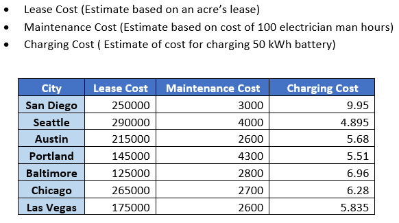
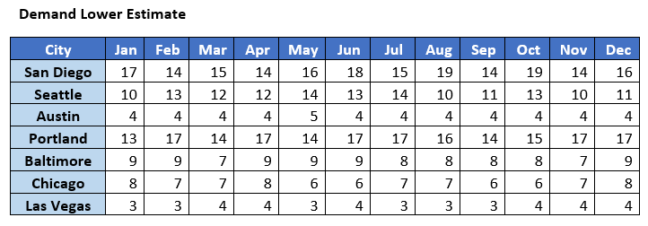
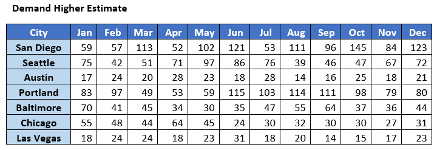
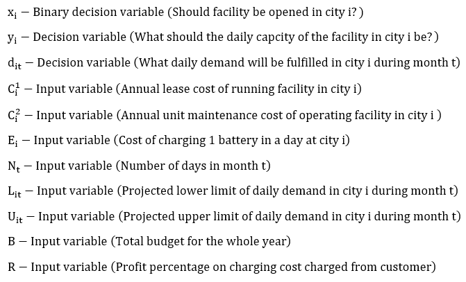
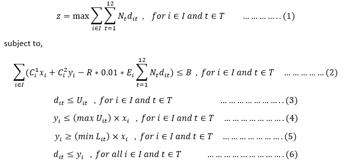
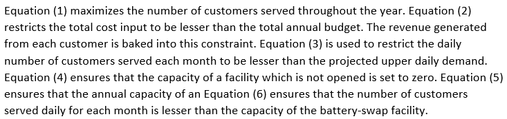

# EV_Battery_Swap
Note: For the python code, reach out to me at https://www.linkedin.com/in/vishalkannan/  
Recommending the optimal daily service capacity for EV battery swap facilities across various cities in the US

## Introduction:

One significant disadvantage for EV ownership from the consumer perspective is the amount of time taken for recharging the EV batteries.
The second disadvantage is that considering the work patterns of most people, most of the EVs owned will be charged at night or at the end of a work-day.
This requires conventional electricity sources to be used for charging the batteries as no solar energy is available at night.
EV battery swap facilities can eliminate both disadvantages.
It drastically reduces the time taken for a battery to go from zero charge to full.
It allows the batteries to be remotely charged at the battery swap facilities when renewable energy is available in abundance.

## Solution Approach:

The solution is to setup battery swap facilities in select cities depending on the annual budget allocated and serve the maximum number of customers possible.

## Parameters:

The optimization needs to be done with respect to the following factors:
* Setup cost, Labor cost, Charging cost
* Lower demand estimate, Upper demand estimate
* Annual Budget

## Cost estimates

Referred to online sources for estimation

## Demand estimates

Simulation based on the number of EVs owned in each city

## Stagewise Optimization

In stage 1 for a given profit percentage and under a given budget, EV battery swap facility capacities are calculated. This answers the question of which cities to setup the facilities in and what the capacity should be. The goal is to maximise the number of customers served. However, each facility needs time to ramp up and attract customers. To accomplish this, a discount on the charging cost is offered in year 1 and the capacity is gradually increased each month. The increase ensures that the budget is not crossed and the maximum number of customers get served.

## Stage 1 Mathematical Model

Variable Declaration

